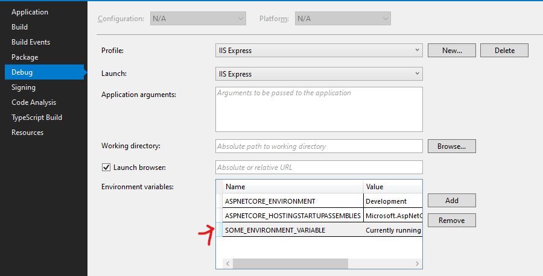
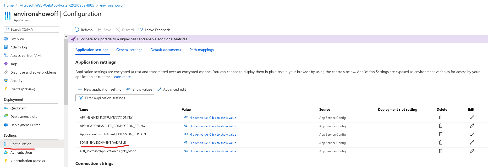

# Environment Variables

You use `IConfiguration` to access them in code.

```
public class HomeController : Controller
{
    private readonly ILogger<HomeController> _logger;
    private readonly IConfiguration _config;

    public HomeController(ILogger<HomeController> logger, IConfiguration config)
    {
        _logger = logger;
        _config = config;
    }

    public IActionResult Index()
    {
        ViewBag.AnEnvironmentValue = _config["SOME_ENVIRONMENT_VARIABLE"];
        return View();
    }

    public IActionResult Privacy()
    {
        return View();
    }

    [ResponseCache(Duration = 0, Location = ResponseCacheLocation.None, NoStore = true)]
    public IActionResult Error()
    {
        return View(new ErrorViewModel { RequestId = Activity.Current?.Id ?? HttpContext.TraceIdentifier });
    }
}
```

Locally, you can right-click on the web project file and set the values in the `Debug` section.



You can set them up for a web app in Azure in the configuration settings.

